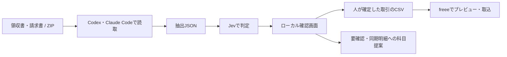

# kicho-bot

日本語の領収書・請求書を読み、TypeSafe/Jevで顧客の科目・方針に沿って判定し、人が確認した取引を**freee取引インポートCSV**にする、Codex / Claude Code共通スキルです。

Jev公式APIとVercel AI Gatewayに対応しています。借方・貸方、判定根拠、確信度はJSONに保存します。freeeへの取り込みはユーザーが行います。



## 目次

- [できること・対応環境](#できること対応環境)
- [インストール](#インストール)
- [APIキーの設定](#apiキーの設定)
- [動作確認](#動作確認)
- [領収書・ZIPを渡して使う](#領収書zipを渡して使う)
- [freeeの対応表を設定する](#freeeの対応表を設定する)
- [コマンドで処理する](#コマンドで処理する)
- [確認画面とCSVの取り込み](#確認画面とcsvの取り込み)
- [架空領収書20件で試す](#架空領収書20件で試す)
- [困ったとき](#困ったとき)
- [更新・削除](#更新削除)
- [開発・ファイル構成](#開発ファイル構成)

## できること・対応環境

| 項目 | 対応内容 |
|---|---|
| エージェント | Codex、Claude Code |
| OS | WSL2 / Linuxで検証。macOSは同じ構成で利用可能ですが未検証 |
| Windows | WSL内で実行。確認キューのファイルロックに`fcntl`を使うためWindowsネイティブは非対応 |
| 入力 | エージェントが読める画像・PDF、これらをまとめたZIP、抽出済みJSON |
| 判定API | Jev公式 / Vercel AI GatewayのTypeSafe互換API |
| freee出力 | 単一明細の収入・支出、全額決済または未決済、税込・内税の取引CSV |
| 対象外 | 複合仕訳、税率混在の一括出力、部分決済、返金、freeeへのAPI直接登録 |

画像・PDFの読取とZIPの展開はホストのエージェントが行います。Pythonスクリプトは抽出済みJSONから判定するため、単独で画像をOCRするコマンドではありません。利用するエージェントの画像・PDF読取機能とファイルアクセスが必要です。

同期済みカード・銀行明細は既存明細への科目提案として扱います。同期状況や既存登録の有無はfreeeから自動取得しません。

## インストール

### 1. 必要なものを用意する

- Git、Python 3.11以上、[uv](https://docs.astral.sh/uv/getting-started/installation/)
- CodexまたはClaude Codeの利用環境
- Vercel AI GatewayまたはTypeSafe/JevのAPIキー（エージェントの契約とは別）
- CSVを取り込む場合はfreee会計の利用環境と、対象事業所の科目・口座・税区分

```bash
git --version
python3 --version
uv --version
```

Nix / Home Managerで管理している場合は、既存設定の`home.packages`へ必要なものだけ追加してください。

```nix
home.packages = with pkgs; [ git python3 uv ];
```

設定の配置先・反映コマンドは手元の構成に合わせます。たとえばWSLのstandalone Home Managerなら`home-manager switch -b backup --flake ~/.config/nix-darwin`、nix-darwinなら`darwin-rebuild switch --flake ~/.config/nix-darwin`です。
Python依存はスクリプト内の定義とロックファイルからuvが用意します。グローバルへのpipインストールは不要です。

### 2. リポジトリを取得する

保存したいフォルダーで実行します。

```bash
git clone https://github.com/Lehtien/kicho-bot.git
cd kicho-bot
```

GitHubの「Code → Download ZIP」で取得した場合は展開し、`README.md`、`scripts/`、`kicho-bot/`があるリポジトリ直下に移動してください。以下のコマンドは、特に記載がなければこの直下で実行します。

### 3. スキルを登録する

両方のエージェントにユーザー全体のスキルとして登録します。

```bash
uv run --no-project python scripts/install-skills.py
```

片方だけ使う場合は次のいずれかを実行します。

```bash
uv run --no-project python scripts/install-skills.py --target codex
uv run --no-project python scripts/install-skills.py --target claude
```

| 登録先 | リンク先 |
|---|---|
| Codex: `~/.agents/skills/kicho-bot` | このリポジトリの`kicho-bot/` |
| Claude Code: `~/.claude/skills/kicho-bot` | 同じ`kicho-bot/` |

既存の別スキルやリンクは上書きしません。同じ場所への登録は何度実行しても構いません。リポジトリを移動・削除するとリンクが切れるため、保存先を決めてから登録してください。

特定の既存プロジェクトだけで使う場合は、ユーザー全体への登録の代わりに次を使います。

```bash
uv run --no-project python scripts/install-skills.py --project /absolute/path/to/project
```

プロジェクト内の`.agents/skills/`と`.claude/skills/`に登録されます。リンクにはこの端末の絶対パスを使うため、共有リポジトリへそのままコミットせず、各端末で登録してください。`--target`との併用も可能です。

### 4. 新しいセッションで呼び出す

Codex:

```text
$kicho-bot 領収書を分類して、freee用の確認キューを作ってください。
```

Claude Code:

```text
/kicho-bot 領収書を分類して、freee用の確認キューを作ってください。
```

スキル一覧に出ない場合は新しいセッションを開始してください。登録したWSL/Linux/macOS側のエージェントで使います。

## APIキーの設定

既存の`.env`を上書きせずにひな型をコピーし、エディターでキーを設定します。

```bash
cp -n .env.example .env
chmod 600 .env
```

Vercel AI Gatewayを使う場合:

```dotenv
KICHO_PROVIDER=vercel
AI_GATEWAY_API_KEY=ここに自分のキー
TYPESAFE_API_KEY=
```

Jev公式を使う場合:

```dotenv
KICHO_PROVIDER=typesafe
TYPESAFE_API_KEY=ここに自分のキー
AI_GATEWAY_API_KEY=
```

| 接続先 | モデルの初期値 | APIエンドポイント |
|---|---|---|
| Vercel AI Gateway | `typesafe-ai/jev` | `https://ai-gateway.vercel.sh/typesafe/v1/systemone` |
| Jev公式 | `jev-latest` | `https://api.typesafe.ai/v1/systemone` |

キーは各サービスで発行します。設定の詳細は[Vercel公式ドキュメント](https://vercel.com/docs/ai-gateway/sdks-and-apis/typesafe)と[TypeSafe APIドキュメント](https://docs.typesafe.ai/api)を参照してください。

- 接続先の優先順は`--provider` → `KICHO_PROVIDER` → 設定済みのキーから自動選択です。両方のキーがある場合は接続先を指定します。
- モデルの優先順は`--model` → `KICHO_MODEL` → 接続先の初期値です。
- `.env`はスクリプトが自動で探しません。`uv run --env-file .env ...`で読み込みます。別フォルダーから使う場合は`.env`の絶対パスを指定してください。
- シェルや秘密管理ツールで環境変数を設定済みなら`--env-file`は省略できます。

キーをチャットや証憑JSONに貼らないでください。`.env`はGitの対象外です。証憑の内容は読取に使うエージェントのサービスへ、抽出テキスト・顧客方針・科目表・履歴ヒントは選んだJev接続先へ渡ります。

## 動作確認

まずAPIを呼ばず、入力とリクエストの生成を確認します。キーは不要です。

```bash
uv run --frozen --script kicho-bot/scripts/classify_journal.py \
  kicho-bot/assets/sample-extracted.json --provider vercel --dry-run
```

次に、サンプル1件で実際のAPIを呼びます。サービスの利用料金が発生します。

```bash
mkdir -p work/demo
uv run --env-file .env --frozen --script kicho-bot/scripts/classify_journal.py \
  kicho-bot/assets/sample-extracted.json > work/demo/draft.json
```

`draft.json`に`journal`、`route`、`answers`などが出れば分類は成功です。終了コードが非ゼロなら、エラーを解消してから先へ進んでください。リダイレクト先のファイルが存在するだけでは成功ではありません。
サンプルの同期・決済状況は未確認です。このままfreeeに取り込むためのデータではありません。

## 領収書・ZIPを渡して使う

### ファイルをまとめる

画像はJPG・PNG、文書はPDFを使えます。複数ある場合はZIPにまとめて、エージェントがアクセスできる場所のパスを渡します。顧客ごと・期間ごとに分けると確認しやすくなります。

```text
work/client-a/
├── inbox/
│   └── receipts-2026-09.zip
├── extracted/             # エージェントが作る抽出JSON
├── drafts/                # Jevの判定JSON
├── freee-mapping.json     # 顧客別の対応表
└── review-queue.json      # 確認状態・CSV出力履歴
```

ZIP内の例:

```text
receipts-2026-09/
├── 2026-09-01_stationery.jpg
├── 2026-09-03_taxi.png
└── 2026-09-10_invoice.pdf
```

ファイル名だけで金額・用途・決済口座を確定しません。文字が潰れている場合やPDFを読めない場合は、推測で埋めずに要確認として扱います。最初は10〜20件程度で、実際の証憑形式に合うか確認すると進めやすくなります。

WSLからWindowsのファイルを参照する場合、`C:\Users\your-name\Downloads\receipts.zip`は通常`/mnt/c/Users/your-name/Downloads/receipts.zip`です。

### エージェントへの依頼例

以下のパス・顧客ID・事業内容を実際のものに置き換えます。Claude Codeでは先頭を`/kicho-bot`にしてください。

```text
$kicho-bot
次のZIPを読んで、freee用の確認キューを作ってください。

証憑: /absolute/path/to/receipts-2026-09.zip
顧客ID: client-a
事業内容: Web制作の個人事業
顧客の科目・計上方針: /absolute/path/to/client-policy.md
freee対応表: /absolute/path/to/freee-mapping.json
API設定: /absolute/path/to/kicho-bot/.env
出力先: /absolute/path/to/kicho-bot/work/client-a/

同期済み明細と決済口座は資料から確認し、不明なら要確認にしてください。
判定根拠を残し、確認画面を開けるところまで進めてください。
取引の確定とfreeeへの取り込みは私が行います。
```

科目・方針の資料がなければ、事業内容、対象期間、よく使う科目、私用混在時の扱いなどを伝えて整理します。freee対応表が未作成なら次の手順で用意します。顧客IDは抽出JSON・対応表・確認キューで統一してください。

`work/`はGitの対象外です。証憑や処理結果をリポジトリの別の場所に置いた場合は、自動的にすべて除外されるわけではありません。

## freeeの対応表を設定する

ひな型を顧客フォルダーにコピーします。

```bash
mkdir -p work/client-a/extracted work/client-a/drafts
cp kicho-bot/assets/freee-mapping.example.json work/client-a/freee-mapping.json
```

freeeの対象事業所にある実際の名称・設定と照合し、編集します。

| 設定 | 内容 |
|---|---|
| `client_id` | 抽出JSONの`client.client_id`と同じ顧客ID |
| `expense_accounts` / `income_accounts` | 内部科目ID → freeeの実際の勘定科目名 |
| `wallets` | 銀行・カード・現金ごとのfreee口座名、相手科目ID、同期状態 |
| `unpaid_accounts` | 未決済として認める相手科目ID |
| `tax_rules` | 収支・税カテゴリ・適格請求書区分・対象期間に応じたfreee税区分名 |
| `partner_names` | 証憑の取引先名 → freeeの取引先名。任意 |
| `verified` | 内容を照合し、使用を認めた対応表だけ`true` |

ひな型の`verified`は`false`です。コピーしただけでは変更しません。税区分は対象期間や事業所設定に合うものを確認してください。必要な対応がなければCSV出力を止めます。
カード利用はカード口座に対応させます。「未払金_カード」という内部科目だけでカード名や銀行引落口座を推測しません。

抽出JSONには次の情報も必要です。詳細な形式は[抽出スキーマ](kicho-bot/references/extract-schema.md)と[freee変換仕様](kicho-bot/references/freee-export.md)を参照してください。

| 項目 | 意味 |
|---|---|
| `extracted.transaction_type` | 支出`expense` / 収入`income` / 不明`unknown` |
| `freee_context.source_status` | 既存取引・同期明細なしを確認した`receipt_only` / 同期済み`synced_statement` / 不明`unknown` |
| `freee_context.statement_id` | 同期明細のID。設定されていれば新規取引のCSV対象外 |
| `freee_context.settlement_status` | 決済済み`paid` / 未決済`unpaid` / 不明`unknown` |
| `freee_context.wallet_key` | 対応表にある実際の決済口座キー。未決済は`null` |
| `freee_context.payment_date` | 実際の決済日。未決済は`null` |
| `freee_context.due_date` / `item` | 支払期日 / freeeの品目名。不要ならそれぞれ`null` / 空文字 |

## コマンドで処理する

画像から抽出済みのJSONがある場合は、次の3段階で進められます。最初のJSONは[入力サンプル](kicho-bot/assets/sample-extracted.json)を参考にしてください。

### 1. Jevで分類する

```bash
uv run --env-file .env --frozen --script kicho-bot/scripts/classify_journal.py \
  work/client-a/extracted/receipt-001.json \
  > work/client-a/drafts/receipt-001.json
```

接続先を明示する場合は`--provider vercel`または`--provider typesafe`を追加します。顧客専用の科目表は`--chart /absolute/path/to/chart.json`で指定できます。
分類がエラーになったファイルはキュー作成に渡さず、原因を解消して再実行してください。

### 2. 確認キューを作成・更新する

```bash
uv run --frozen --script kicho-bot/scripts/freee_deals.py \
  work/client-a/drafts/*.json \
  --mapping work/client-a/freee-mapping.json \
  --out work/client-a/review-queue.json
```

顧客ごとに同じキューファイルを使います。既存のキューへ追加・更新でき、内容や対応表が変わった候補の確定は失効します。

### 3. 確認画面を起動する

```bash
uv run --frozen --script kicho-bot/scripts/review_freee.py \
  work/client-a/review-queue.json
```

ターミナルに表示される`http://127.0.0.1:8765/#...`を、末尾のトークンまで含めてブラウザーで開きます。ローカルの認証付き画面です。終了は`Ctrl+C`。ポートが使用中なら`--port 8766`を追加できます。

## 確認画面とCSVの取り込み

1. 証憑の内容、金額、日付、科目、税区分、決済口座、既存登録の有無を確認します。
2. 出力可能な行の「この取引を確定」を押します。
3. 「確定した取引をCSV出力」でUTF-8 BOM付きCSVをダウンロードします。
4. freee会計の「取引データのインポート」でCSVを選び、プレビューを確認して取り込みます。

振替伝票用の仕訳CSVではありません。操作は[freee公式の取引インポート手順](https://support.freee.co.jp/hc/ja/articles/202847320)を参照してください。

| 状態 | 扱い |
|---|---|
| `candidate_auto`、対応表が完成、同期重複なし | 人が確定した後だけCSVに含める |
| `review` | 証憑・方針などを確認・修正し、再判定する |
| 同期済み口座・明細 | 既存明細への科目提案。新規取引CSVには含めない |
| 対応表不足、未確認、同期・決済状態不明 | CSVに含めない |
| 出力済み | 同じキューから新たに出力せず、履歴から元のCSVを再取得できる |

`candidate_auto`は仕訳候補の区分で、自動登録済みという意味ではありません。`review`の理由・判定条件は[振り分け仕様](kicho-bot/references/routing.md)に記載しています。

freeeへの取り込み済みかどうかは自動照会しません。同じCSVを重複インポートしないでください。別キューの作成や抽出内容の変更では同一証憑を検出できないことがあります。freeeの管理番号も重複排除キーではありません。
確認キューには証憑情報・確定状態・出力したCSVを保存するため、顧客ごとに保管・バックアップしてください。

## 架空領収書20件で試す

[テストデータ](tests/fixtures/receipts/README.md)には、通常経費、未払い、私用、税率混在、読取不明、現金売上など20件を用意しています。店舗・取引・方針は架空です。領収書風テキストと抽出済みJSONであり、画像OCRの試験ではありません。

```bash
uv run --env-file .env --frozen --script tests/run-receipt-evaluation.py \
  --out tests/results/my-first-run
```

実APIを20回呼びます。出力先は未使用のフォルダー名にしてください。期待値はAPIに送らず、結果と比較します。1件だけなら次のように指定します。

```bash
uv run --env-file .env --frozen --script tests/run-receipt-evaluation.py \
  --case 01-stationery --out tests/results/my-single-run
```

結果のJSONと`REPORT.md`は指定先に保存します。`tests/results/`はGitの対象外です。

[実APIでの検証結果](docs/evaluation.md): 修正後は再試行を含め20件が正常完了し、候補12件・要確認8件、事前想定との全項目一致は17件でした。これは小規模な架空データの結果です。テスト用の対応表は未確認なので、実際のfreeeへ取り込まないでください。

## 困ったとき

| 症状 | 確認すること |
|---|---|
| スキルが出てこない | 登録先とリンク先、新しいセッション、エージェントを起動したOSを確認 |
| 既存の登録がありインストールできない | 既存スキルの内容を確認。必要なものを退避し、対象リンクを整理してから再実行 |
| キーがないと言われる | `--env-file`の指定、`.env`のパス、選択した接続先とキー変数の組み合わせを確認 |
| 401 / 403 | キーの有効性と接続先の利用権限を確認 |
| 429 / 503 | 利用上限やサービス状況を確認し、失敗した件だけ時間を置いて再実行 |
| 応答形式エラー | エラーを記録し、その件だけ再実行。検証を外してCSVへ流さない |
| 顧客IDの不一致 | 抽出JSON、対応表、既存キューのIDを確認。顧客ごとにキューを分ける |
| 確定ボタンが押せない | `review`の理由、`verified`、不足する税区分・口座、同期・決済状態を確認 |
| 画面の認証エラー | 起動時に表示されたURLの`#`以降も含めて開く。再起動後は新しいURLを使う |
| 更新後も古い候補が残る | 必要な証憑を再分類し、同じキューに対して作成・更新コマンドを実行 |

## 更新・削除

Gitで取得した場合はリポジトリ直下で更新します。

```bash
git pull --ff-only
```

同じ保存先ならスキルの再登録は不要です。`.env`や`work/`はそのまま使えます。更新時に入力形式が変わった場合は、新しい仕様に合わせて再判定してください。

登録を削除する場合は、次のパスがこのリポジトリを指すシンボリックリンクであることを確認し、リンクだけを削除します。実体のスキル・証憑・キューは残ります。

```bash
ls -ld ~/.agents/skills/kicho-bot ~/.claude/skills/kicho-bot
```

確認できた対象だけ実行します。

```bash
unlink ~/.agents/skills/kicho-bot
unlink ~/.claude/skills/kicho-bot
```

プロジェクト内に登録した場合は、そのプロジェクトの`.agents/skills/kicho-bot`または`.claude/skills/kicho-bot`が対象です。

## 開発・ファイル構成

APIを呼ばないローカルテスト:

```bash
uv run --with 'pydantic>=2.12,<3' python -m unittest discover -s tests -v
```

分類条件、入力・応答の検証、取引CSVへの変換、同期・顧客混在・未確認データの除外、確認画面の認証・確定・CSV出力を検証します。

```text
.
├── README.md
├── .env.example
├── scripts/install-skills.py
├── kicho-bot/
│   ├── SKILL.md                  # エージェント共通の作業手順
│   ├── assets/                   # 入力例・科目表・対応表・確認画面
│   ├── references/               # 抽出形式・Jev質問・振り分け・freee仕様
│   └── scripts/                  # 分類・変換・ローカル確認サーバー
├── tests/
│   ├── test_kicho.py
│   ├── fixtures/receipts/        # 架空領収書20件
│   └── run-receipt-evaluation.py
└── docs/evaluation.md            # 実API検証の要約
```

仕様の参照先（2026-09-24確認）:
[Codexのスキル](https://developers.openai.com/codex/skills/)、
[Claude Codeのスキル](https://code.claude.com/docs/en/skills)、
[VercelのTypeSafe互換API](https://vercel.com/docs/ai-gateway/sdks-and-apis/typesafe)、
[TypeSafe API](https://docs.typesafe.ai/api)、
[freee取引インポート](https://support.freee.co.jp/hc/ja/articles/202847320)。
